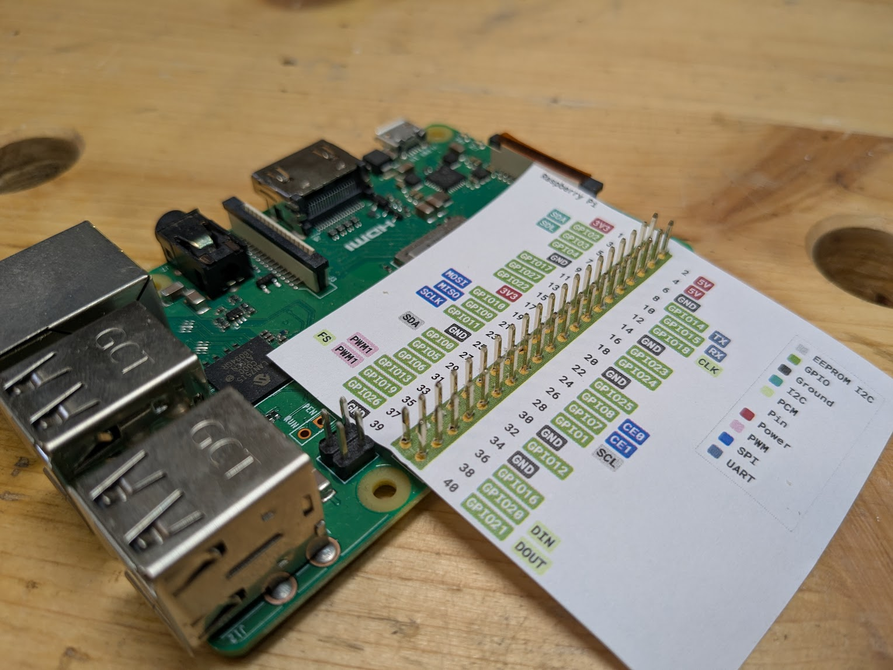
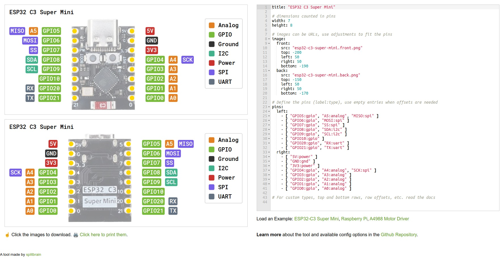

# Pinout Leaf Generator

Pinout diagrams for microcontrollers and other PCBs are well known, but it can be hard always comparing the pinout diagram with the real PCB, counting pins. One solution is to print out a diagram that has exactly the right size to push the pins through the paper and have the labels right next to the actual pin.

This project is meant for easily creating such pinout leafs.

The pins can be described by a simple YAML-based description and the tool automatically creates the diagram as an SVG.



## Features

* **SVG Output:**
  * Generates clean, scalable SVG diagrams.
  * Default sizes match the real-world PCB exactly — just print at 100%.
  * Fully self-contained, font and image resources are embedded into the file so it's fully portable.

* **Configuration:**
  * Define pinouts, board dimensions, labels, and types using simple YAML or JSON files.
  * Custom types allow control over colors and legend labels.

* **Web Editor:**
  * Real-time preview of the diagram as you edit the configuration.
  * Syntax highlighting for YAML.
  * Download generated SVG diagrams.

* **CLI Tool:**
  * Process multiple configuration files or entire directories to generate SVG diagrams programmatically.

* **Front & Back Views:**
  * Automatically generates diagrams for both the front and back sides of the PCB.

## Screenshot



## Limits

  * Only four rows of pins are supported.
  * No weird arbitrary layouts.
  * Only the standard 0.1-inch pin raster is supported (might change in the future).

## Alternatives

- [Youtube: Feather Diagrams Walk-Through for Adafruit](https://www.youtube.com/watch?v=ndVs1UvK6AE) — doing it the manual way in Inkscape
- [GenPinoutSVG](https://github.com/stevenj/GenPinoutSVG) — a Python tool using CSV files as input
- [Pinion](https://yaqwsx.github.io/Pinion/) — creates pinout diagrams from KiCAD PCB files
- [PCBDraw](https://github.com/yaqwsx/PcbDraw) — another KiCAD-based tool
- [Integrated Circuit Pinout Diagram Generator](https://github.com/cmfcmf/ic-pinout-diagram-generator) — probably closest to this project, but without an editor

None of the tools above focus on dimensional accuracy and printing. They are more about creating diagrams for documentation or web pages.

## Usage

### Web Editor

1. Go to https://splitbrain.github.io/pinoutleaf/
2. Edit the YAML configuration in the editor.
3. The SVG diagrams will update automatically.
4. Click the images to download them.

Feel free to open an issue when you create a new pinout leaf and we can add it to the list of existing leafs.

### Premade Leafs

Check the [pinouts](https://github.com/splitbrain/pinoutleaf/tree/gh-pages/pinouts) directory for boards that have already been defined.

Open a [pull request](https://github.com/splitbrain/pinoutleaf/pulls) or [ticket](https://github.com/splitbrain/pinoutleaf/issues) if you made one and want it included in the repo.

### Printing

* Download the SVG and open it in an SVG-capable tool — your browser is fine.
* Print and make sure your application or printer driver does not apply any scaling (scale: 100%).
* Optionally poke holes in the marked pin holes with a needle.
* Carefully push your PCB's pins through the paper; using a jumper wire can help with that.
* Enjoy the labels next to the pins.

### Command-Line Interface (CLI)

1. Clone the repo.
2. Install dependencies:
   ```bash
   npm install
   ```
3. Build the project (for web editor and CLI):
   ```bash
   node build.js
   ```
4. Run the CLI tool with configuration files or directories as arguments:
   ```bash
   node public/dist/cli.js path/to/your/config.yaml
   ```
5. The tool will generate corresponding `.svg` files (e.g., `config.front.svg`, `config.back.svg`) in the same directory as the input files.

## Configuration Syntax

Diagrams are configured using YAML or JSON files. Most things have sensible defaults.

Note: only YAML is supported in the web editor.

### title

Defines the title of the diagram:

```yaml
title: "My PCB"
```

### size

The size of the PCB is defined in the number of pins (assuming a standard pin raster of 0.1 inch, aka 2.54mm). Everything else is derived from this size. Best to put your board on a breadboard and count.

```yaml
width: 4
height: 6
```

### pins

The tool supports up to four rows of pins: `left`, `right`, `top`, and `bottom`. If your board does have a different layout, you're out of luck.

For each row, you define an array of pins. For each pin, you define an array of `label:type` strings. You can have empty pins in a row.

```yaml
pins:
  left:
    - [ "GPIO5:gpio", "A5:analog", "MISO:spi" ]
    - [ "GPIO6:gpio", "MOSI:spi" ]
    -
    - [ "GPIO20:gpio", "RX:uart" ]
    - [ "GPIO21:gpio", "TX:uart" ]
  right:
    -
    -
    - [ "5V:power" ]
    - [ "GND:gnd" ]
    - [ "3V3:power" ]
```

### types

Types define the background color, text color, and legend label for a set of pins. Simply give the type a name, define the properties, and then use it by name in the `pins` definition.

```yaml
types:
  mytype:
    label: 'Special Pins'
    bgcolor: '#ff00ff'
    fgcolor: '#000000'
```

There are the following predefined types, which you can use without defining them yourself:

- `gpio`
- `power`
- `gnd`
- `i2c`
- `uart`
- `spi`
- `analog`

### image

For nicer diagrams, you can define background images (JPEG or PNG only) to use instead of the general green PCB background.

You can set a front and back side image separately. Images can be referenced as local files or as URLs. In both cases, the generator will try to actually embed the image in the generated SVG as a Data URL.

By default, your image will be stretched to exactly match the size defined by the pins. However, your picture will probably not fit exactly. Using the `left`, `right`, `top`, and `bottom` properties, you can define offsets from the respective edges.

Negative numbers will move the image edge outward, positive numbers inward. The offsets are given in hundredths of a millimeter, e.g., 100 is 1mm. Best to interactively experiment in the web editor until the image fits.

```yaml
image:
  front:
    src: "esp32-c3-super-mini.front.png"
    top: -200
    left: 50
    right: 50
    bottom: -190
  back:
    src: "https://example.com/productimage.jpeg"
    top: -150
    left: 50
    right: 50
    bottom: -170
```

### offsets

By default, the pin rows will sit on the edges of the defined board size. Sometimes you might want to define your board's size larger than the actual pin area. You can use the offsets setting to move a pin row further in.

For example, the Raspberry Pi has two rows of pins all the way to the right edge of a much larger board. In this case, you might want to define the overall size of the board but then offset the left row of pins so it moves over nearly to the right edge.

Only use positive integers and be sure not to push your row outside of the size dimensions.

```yaml
offsets:
  left: 0
  top: 0
  right: 0
  bottom: 0
```

# License

MIT License

Copyright (c) 2025 Andreas Gohr

Permission is hereby granted, free of charge, to any person obtaining a copy
of this software and associated documentation files (the "Software"), to deal
in the Software without restriction, including without limitation the rights
to use, copy, modify, merge, publish, distribute, sublicense, and/or sell
copies of the Software, and to permit persons to whom the Software is
furnished to do so, subject to the following conditions:

The above copyright notice and this permission notice shall be included in all
copies or substantial portions of the Software.

THE SOFTWARE IS PROVIDED "AS IS", WITHOUT WARRANTY OF ANY KIND, EXPRESS OR
IMPLIED, INCLUDING BUT NOT LIMITED TO THE WARRANTIES OF MERCHANTABILITY,
FITNESS FOR A PARTICULAR PURPOSE AND NONINFRINGEMENT. IN NO EVENT SHALL THE
AUTHORS OR COPYRIGHT HOLDERS BE LIABLE FOR ANY CLAIM, DAMAGES OR OTHER
LIABILITY, WHETHER IN AN ACTION OF CONTRACT, TORT OR OTHERWISE, ARISING FROM,
OUT OF OR IN CONNECTION WITH THE SOFTWARE OR THE USE OR OTHER DEALINGS IN THE
SOFTWARE.
